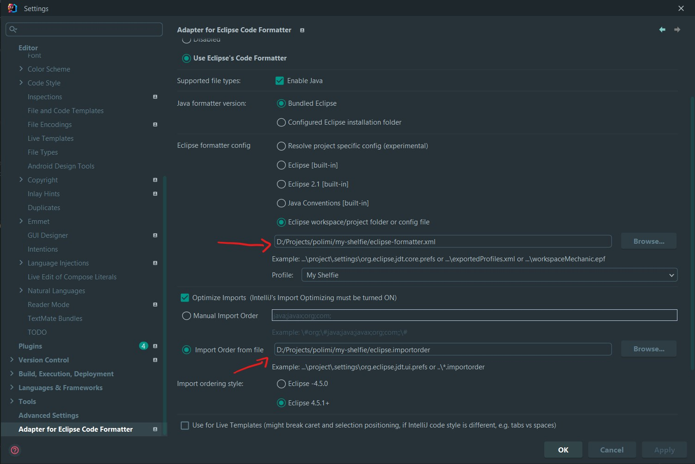

# Code Style

Code style is enforced by the maven spotless plugin using the eclipse formatter.

Formatting configs can be found in the root of the repo, as
`eclipse-formatter.xml` and `eclipse.importorder` for
formatting and import order respectively.

## Eclipse or VS Code

If you are using Eclipse or VS Code, you should be able to use their out-of-the-box
formatter by importing the setting files

## Idea

You need to install the 'Adapter for Eclipse Code Formatter' plugin and
configure it like the following:
