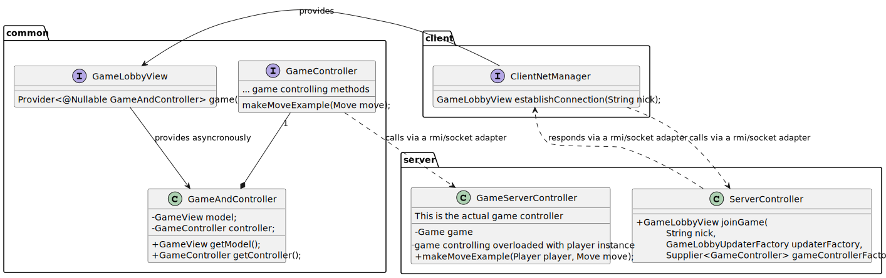

# Project for the course "software engineering" at Politecnico di Milano, academic year 2022/2023

See specs [here](docs/Requisiti.pdf)

## Code Style

See [here](CODE_STYLE.md)

## UML Class Diagram:

<picture>
  <source media="(prefers-color-scheme: dark)" srcset="docs/model-uml-dark.svg">
  <source media="(prefers-color-scheme: light)" srcset="docs/model-uml.svg">
  
</picture>

<picture>
  <source media="(prefers-color-scheme: dark)" srcset="docs/controller-dark.svg">
  <source media="(prefers-color-scheme: light)" srcset="docs/controller.svg">
  
</picture>
